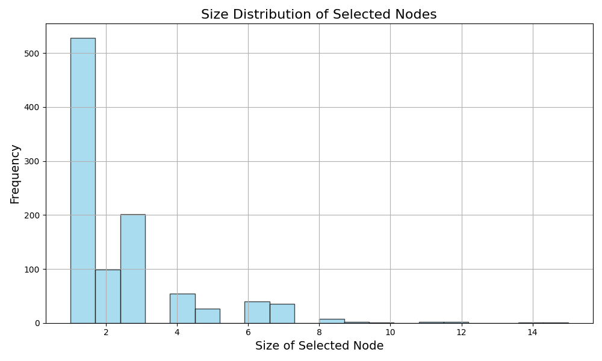
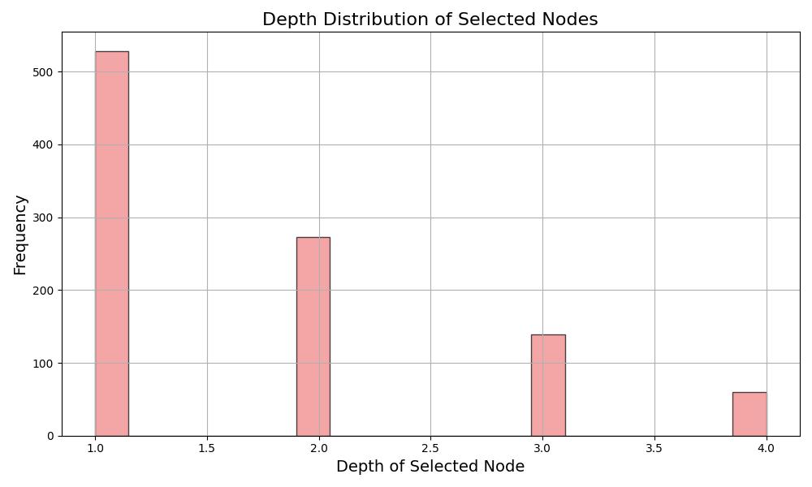
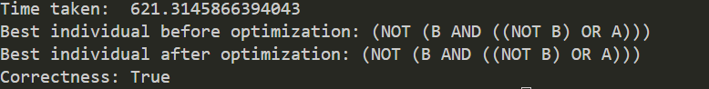
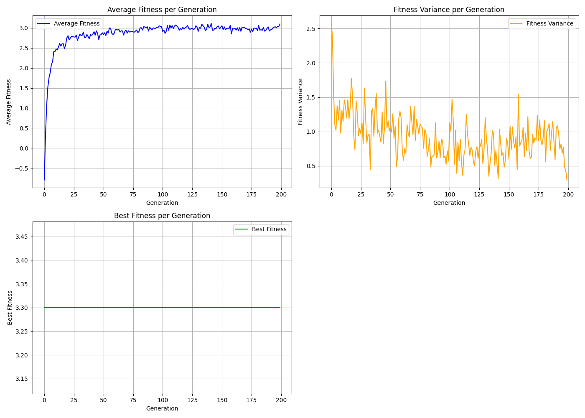
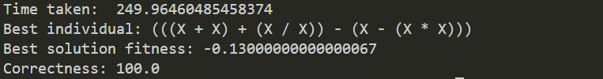
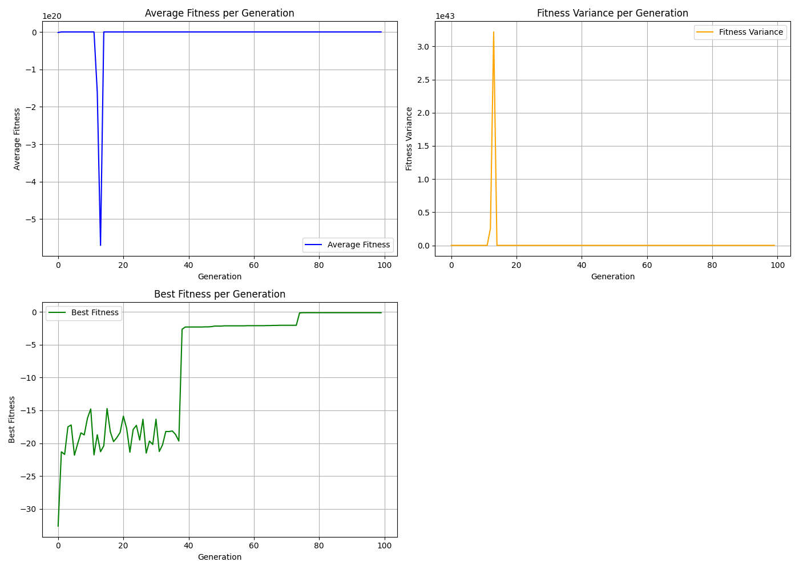
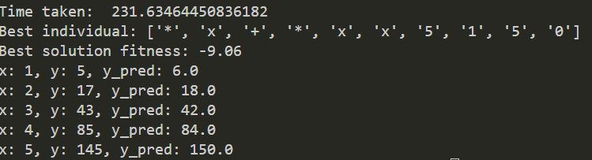
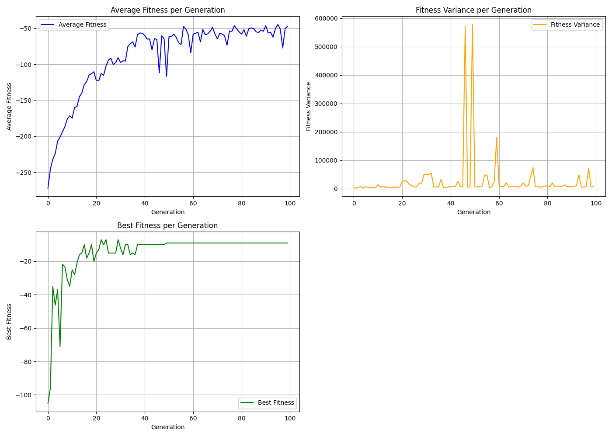

Let's start with the first section of your report, titled "GP (Genetic Programming)." This section will explain the task and provide a detailed explanation of your implementation, including representation, crossover, fitness, mutation, and other relevant aspects. Here's a structured version of this section:

---

# GP (Genetic Programming)

## Task Overview

The task involves developing a Genetic Programming (GP) framework capable of evolving logical expressions that adhere to specific constraints. The goal is to represent individuals as logical trees, evaluate their fitness against target functions, and apply genetic operators like crossover and mutation to evolve better solutions over generations. The GP framework should ensure that the evolved trees are valid, avoid bloat, and optimize performance through well-defined strategies.

## Implementation Details

### Individual Representation

In our implementation, we represent individuals as binary trees where each node can be an operator (e.g., AND, OR, NOT) or a terminal (e.g., A, B). This structure is encapsulated in the `GP` class, which holds the value of the node and pointers to its left and right children. Constants are used for operators and terminals to improve readability and code maintenance. We also introduced a `MAX_DEPTH` constraint to prevent unbounded tree growth, ensuring that the tree structure remains manageable and execution times are kept within reasonable limits.

```python
class GP:
    MAX_DEPTH = 4
    A = 1
    B = 2
    AND = 3
    OR = 4
    NOT = 5

    TRUE = 6
    FALSE = 7
    NEGATION = 8

    def __init__(self, value: int, left=None, right=None) -> None:
        self.value = value
        self.left = left
        self.right = right
```

### Individual Generation

To create individuals, we developed a `GPFactory` class that handles random tree generation using two methods: the `full` method, which generates trees up to the maximum depth with all nodes as operators, and the `grow` method, which randomly decides whether to add an operator or a terminal at each node, allowing for varied tree shapes.

```python
class GPFactory:
    @staticmethod
    def generate_full_tree(depth, max_depth):
        if max_depth < 0:
            logging.warning("Max depth is less than 0, ignoring generation")
            return
        if depth >= max_depth:
            return GP(random.choice([GP.A, GP.B]))
        else:
            operator = random.choice([GP.AND, GP.OR, GP.NOT])
            if operator == GP.NOT:
                return GP(operator, left=GPFactory.generate_full_tree(depth + 1, max_depth))
            else:
                return GP(operator, left=GPFactory.generate_full_tree(depth + 1, max_depth), right=GPFactory.generate_full_tree(depth + 1, max_depth))

    @staticmethod
    def generate_grow_tree(depth, max_depth):
        if depth == max_depth or (depth > 0 and random.random() > 0.5):
            return GP(random.choice([GP.A, GP.B]))
        else:
            operator = random.choice([GP.AND, GP.OR, GP.NOT])
            if operator == GP.NOT:
                return GP(operator, left=GPFactory.generate_grow_tree(depth + 1, max_depth))
            else:
                return GP(operator, left=GPFactory.generate_grow_tree(depth + 1, max_depth), right=GPFactory.generate_grow_tree(depth + 1, max_depth))
```

This dual approach ensures a diverse initial population, critical for exploring the solution space effectively.

### Fitness Function

Fitness evaluation is key to guiding the evolutionary process. The `GPFitness` class compares the output of an individual's logical expression to a target function (e.g., XOR) and penalizes larger trees to avoid bloat. The fitness is calculated based on how many correct outputs the tree produces and how closely the tree size matches an optimal size.

```python
class GPFitness(FitnessFunction):
    def __init__(self, lambda_penalty, opt_size, target_function):
        self.lambda_penalty = lambda_penalty
        self.opt_size = opt_size
        self.target_function = target_function

    def evaluate(self, individual) -> float:
        hits = 0
        for a in [True, False]:
            for b in [True, False]:
                if individual.evaluate(a, b) == self.target_function(a, b):
                    hits += 1

        return hits - self.lambda_penalty * abs(self.opt_size - individual.size())
```

### Crossover

Crossover in our GP framework involves selecting random nodes from two parent trees and swapping them to create offspring. We implemented a non-uniform node selection method to avoid disproportionately selecting leaf nodes, which could result in excessive tree growth. After the swap, we prune any branches that exceed the `MAX_DEPTH` to ensure the tree remains within the allowed size.

```python
def select_random_node(self) -> tuple['GP', int]:
    candidate = None
    candidate_depth = 0

    def visit(node, depth=1):
        nonlocal candidate, candidate_depth
        if node is None:
            return

        if random.randint(1, depth) == 1:
            candidate = node
            candidate_depth = depth

        visit(node.left, depth + 1)
        visit(node.right, depth + 1)

    visit(self)
    return candidate, candidate_depth - 1
```






### Mutation

We implemented two types of mutations: point mutation and subtree mutation. Point mutation randomly changes the value of a node while ensuring that operators remain operators and terminals remain terminals. Subtree mutation replaces an entire subtree with a newly generated one. Both methods respect the `MAX_DEPTH` constraint to maintain valid and efficient tree structures.

```python
class GPMutation:
    def subtree_mutation(self, ind: GP):
        node, depth = ind.select_random_node()
        new_subtree = GPFactory.generate_individual('full', GP.MAX_DEPTH - depth)
        if new_subtree is None:
            return

        node.value = new_subtree.value
        node.left = new_subtree.left
        node.right = new_subtree.right
```

### Anti-Bloating Techniques

To further prevent bloat, we developed the `GPBloat` class, which optimizes trees by applying logical simplifications. These include removing redundant operators, collapsing double negations, and applying De Morgan's laws. This step ensures that trees remain minimal in size without losing their logical integrity, leading to faster evaluations and more straightforward results.

```python
class GPBloat:
    def remove_redundant_operators(self, ind: GP):
        if not ind.is_operator():
            return
        if ind.left is None:
            return
        if ind.right is None:
            return
        if not ind.left.is_terminal() or ind.left.value == ind.value:
            return
        if ind.left.value == ind.right.value:
            ind.value = ind.left.value
            ind.left = None
            ind.right = None
```

### Plots

#### NAND Result


#### XOR Run Fitness Plot



# GPA (Arithmetic Genetic Programming)

## Task Overview

The goal of this task is to approximate a univariate polynomial function within the range \([-1, 1]\) using Arithmetic Genetic Programming (GPA). Unlike the logical GP implementation, GPA focuses on arithmetic operations such as addition, subtraction, multiplication, and division, with the terminal node representing the variable \(x\). The primary objective is to evolve expressions that closely match a target polynomial function over the specified range, optimizing for both accuracy and simplicity.

## Implementation Details

### Individual Representation

In GPA, individuals are represented as binary trees similar to the logical GP framework, but with arithmetic operations at the nodes. The `GPA` class encapsulates this representation, with each node being an operator (e.g., ADD, SUB, MUL, DIV) or the terminal \(x\).

```python
class GPA:
    MAX_DEPTH = 10
    X = 1
    ADD = 2
    SUB = 3
    MUL = 4
    DIV = 5

    def __init__(self, value: int, left=None, right=None) -> None:
        self.value = value
        self.left = left
        self.right = right
```

### Individual Generation

We use the `GPAFactory` class to generate individuals, employing both `full` and `grow` methods similar to the GP framework. The primary difference lies in the operators and the terminal, which are now arithmetic in nature.

```python
class GPAFactory:
    @staticmethod
    def generate_full_tree(depth, max_depth):
        if max_depth < 0:
            logging.warning("Max depth is less than 0, ignoring generation")
            return None
        if depth >= max_depth:
            terminal_value = GPA.get_random_terminal()
            return GPA(terminal_value, left=None, right=None)
        else:
            operator = GPA.get_random_operator()
            return GPA(
                operator,
                left=GPAFactory.generate_full_tree(depth + 1, max_depth),
                right=GPAFactory.generate_full_tree(depth + 1, max_depth)
            )
```

By controlling the depth and structure of the trees, we ensure that the resulting arithmetic expressions are well-formed and capable of representing complex polynomial functions.

### Evaluation

The evaluation of a GPA individual involves computing the value of the expression for a given \(x\) within the range \([-1, 1]\). The `evaluate` method handles the arithmetic operations, including a special case for division by zero, which is assumed to return 1 for simplicity.

```python
def evaluate(self, x_value: float) -> float:
    if self.value == GPA.X:
        return x_value
    elif self.value == GPA.ADD:
        return self.left.evaluate(x_value) + self.right.evaluate(x_value)
    elif self.value == GPA.SUB:
        return self.left.evaluate(x_value) - self.right.evaluate(x_value)
    elif self.value == GPA.MUL:
        return self.left.evaluate(x_value) * self.right.evaluate(x_value)
    elif self.value == GPA.DIV:
        right_value = self.right.evaluate(x_value)
        return self.left.evaluate(x_value) / right_value if right_value != 0 else 1
    else:
        raise ValueError("Invalid node value")
```

This approach allows the GPA framework to approximate the target polynomial function by evolving arithmetic expressions that compute values close to those of the target function over the specified range.

### Fitness Function

The fitness of a GPA individual is evaluated based on how closely its expression matches the target function across a sample of \(x\) values in the \([-1, 1]\) range. The fitness function penalizes larger trees and expressions with significant errors, using a `lambda_penalty` to balance accuracy and complexity.

```python
class GPAFitness(FitnessFunction):
    def __init__(self, lambda_penalty: float, opt_size: int, target_function: callable, error_range: float, sample_size: int):
        self.lambda_penalty = lambda_penalty
        self.opt_size = opt_size
        self.target_function = target_function
        self.error_range = error_range
        self.sample_size = sample_size

    def evaluate(self, individual) -> float:
        hits = 0
        parity = 0

        for _ in range(self.sample_size):
            x = random.uniform(-1, 1)
            val = individual.evaluate(x)
            diff = abs(val - self.target_function(x))
            parity += diff
            if val < self.error_range:
                hits += 1

        if self.opt_size is None:
            return hits - self.lambda_penalty * individual.size() - parity
        else:
            return hits - self.lambda_penalty * (individual.size() - self.opt_size) - parity
```

This function not only evaluates how well the expression approximates the target polynomial but also encourages simpler, more efficient solutions by penalizing excessive complexity.

### Crossover

The crossover operation in GPA involves selecting random nodes from two parent trees and swapping them to produce offspring. As with the GP framework, we ensure that the resulting trees do not exceed the `MAX_DEPTH` constraint and apply optimization techniques to remove any redundant operations.

```python
class GPACrossover:
    def __init__(self, optimizer: GPABloat):
        self.optimizer = optimizer

    def crossover(self, parent1: GPA, parent2: GPA):
        child1 = parent1.copy()
        child2 = parent2.copy()

        node1, _ = child1.select_random_node()
        node2, _ = child2.select_random_node()

        node1.value, node2.value = node2.value, node1.value
        node1.left, node2.left = node2.left, node1.left
        node1.right, node2.right = node2.right, node1.right

        child1.prune_to_max_depth()
        child2.prune_to_max_depth()

        self.optimizer.optimize(child1)
        self.optimizer.optimize(child2)

        return child1, child2
```

### Mutation

Similar to the logical GP, we implemented point mutation and subtree mutation for GPA. Point mutation randomly changes a node's value while ensuring that the node type (operator or terminal) is preserved. Subtree mutation replaces an entire subtree with a newly generated one, maintaining the validity of the expression.

```python
class GPAMutation:
    def __init__(self, optimizer: GPABloat):
        self.optimizer = optimizer

    def subtree_mutation(self, ind: GPA):
        node, depth = ind.select_random_node()
        new_subtree = GPAFactory.generate_individual('full', GPA.MAX_DEPTH - depth)
        if new_subtree is None:
            return

        node.value = new_subtree.value
        node.left = new_subtree.left
        node.right = new_subtree.right

    def point_mutation(self, ind: GPA):
        node, _ = ind.select_random_node()

        if node.is_operator():
            node.value = GPA.get_random_operator()
            node.extra = None  # Operators don't need the extra field

            if node.left is None:
                node.left = GPAFactory.generate_individual('full', GPA.MAX_DEPTH - 1)
            if node.right is None:
                node.right = GPAFactory.generate_individual('full', GPA.MAX_DEPTH - 1)
```

### Plots





# GEP (Gene Expression Programming)

## Task Overview

Gene Expression Programming (GEP) is an evolutionary algorithm that evolves programs or expressions, represented in a linear chromosome structure, to solve problems or optimize functions. In this task, we implemented GEP to evolve arithmetic expressions that approximate a given function over a specified range.

GEP differs from traditional Genetic Programming (GP) in that it separates the genotype (linear chromosome) from the phenotype (expression tree). The linear chromosomes are translated into expression trees, which are then evaluated for fitness.

## Implementation Details

### Individual Representation

In GEP, individuals are represented by a linear string of symbols, known as the "head," which contains both functions and terminals. The head is followed by a "tail," which consists of terminals only and ensures that the expression is syntactically valid.

The `GEP` class captures this representation, with the head being of a fixed size (e.g., 20 symbols). The tail is generated dynamically to validate the expression.

```python
class GEP:
    TERMINALS = ['x', '0', '1', '2', '3', '4', '5', '6', '7', '8', '9']
    FUNCTIONS = ['+', '-', '*', '/']

    def __init__(self, exp: list[str]):
        self.exp = exp
        self.best_fitness = None
        self.best_tail = None
```

### Evaluation

The evaluation of a GEP individual involves computing the value of the expression for a given \(x\) within the target range. The expression is evaluated using a stack-based approach, ensuring that the operators are applied correctly to their operands.

```python
@staticmethod
def evaluate_exp(chromosome: list[str], x_value: float) -> int:
    stack = []
    res = None
    for gene in reversed(chromosome):
        if gene == 'x':
            if res is None:
                res = x_value
            stack.append(x_value)
        elif gene == '+':
            arg1 = stack.pop()
            arg2 = stack.pop()
            res = arg1 + arg2
            stack.append(res)
        elif gene == '-':
            arg1 = stack.pop()
            arg2 = stack.pop()
            res = arg1 - arg2
            stack.append(res)
        elif gene == '*':
            arg1 = stack.pop()
            arg2 = stack.pop()
            res = arg1 * arg2
            stack.append(res)
        elif gene == '/':
            arg1 = stack.pop()
            arg2 = stack.pop()
            res = arg1 / arg2 if arg2 != 0 else 1
            stack.append(res)
        else:
            if res is None:
                res = float(gene)
            stack.append(float(gene))
    return res
```

This approach ensures that the arithmetic expressions generated by the GEP framework are evaluated correctly, allowing the system to evolve expressions that approximate the target function.

### Ensuring Validity

The head of the chromosome may not always be a valid expression. Therefore, a tail is generated to ensure that the expression is syntactically valid. The tail is composed entirely of terminals and is generated dynamically based on the number of terminals needed to make the expression valid.

```python
@staticmethod
def calc_needed_terminals(chromosome: list[str]) -> int:
    stack_size = 0
    missing = 0
    for gene in reversed(chromosome):
        if gene in GEP.TERMINALS:
            stack_size += 1
        else:
            stack_size -= 2
            if stack_size < 0:
                missing += -stack_size
                stack_size = 0
            stack_size += 1
    return missing
```

This method simulates the evaluation of the stack to determine the number of terminals required to complete the expression, ensuring that it can be evaluated without errors.

### Fitness Evaluation

The fitness of a GEP individual is determined by how closely the generated expression matches the target function across a range of \(x\) values. Multiple tail attempts are generated, and the one yielding the best fitness is selected.

```python
class GEPFitness:
    def __init__(self, target_data: list, tail_attempts: int, size_factor: float):
        self.target_data = target_data
        self.tail_attempts = tail_attempts
        self.size_factor = size_factor

    def fitness(self, chromosome: list[str]) -> float:
        error = 0.0
        for x, y in self.target_data:
            y_pred = GEP.evaluate_exp(chromosome, x)
            error += abs(y - y_pred)
        size = GEPFactory.calc_size(chromosome)
        return -error - self.size_factor * size

    def evaluate(self, head: GEP) -> float:
        max_fitness = None
        best_tail = None
        for _ in range(self.tail_attempts):
            tail = GEPFactory.generate_tail(head.exp)
            full_chromosome = head.exp + tail
            ind_fitness = self.fitness(full_chromosome)
            if max_fitness is None or ind_fitness > max_fitness:
                max_fitness = ind_fitness
                best_tail = tail
        
        head.best_fitness = max_fitness
        head.best_tail = best_tail
        return max_fitness
```

This fitness function evaluates the GEP individuals by considering both the accuracy of the expression and the size of the generated chromosome, penalizing overly complex solutions.

### Mutation

Mutation in GEP involves altering the head of the chromosome. Each symbol in the head has a probability of being mutated, with the mutation rate controlling this probability. Since the tail is generated dynamically, only the head is subject to mutation.

```python
class GEPMutation:
    def __init__(self, mutation_rate: float):
        self.mutation_rate = mutation_rate

    def mutate(self, chromosome: GEP, *args, **kwargs) -> GEP:
        new_chromosome = []
        for gene in chromosome.exp:
            if random.random() < self.mutation_rate:
                new_gene = random.choice(GEP.TERMINALS + GEP.FUNCTIONS)
                new_chromosome.append(new_gene)
            else:
                new_chromosome.append(gene)
        return GEP(new_chromosome)
```

This mutation process introduces variation into the population, allowing the GEP algorithm to explore new potential solutions.

### Crossover

Crossover in GEP is straightforward, given the fixed length of the head. A single-point crossover is performed between two parents to generate offspring.

```python
class GEPCrossover:
    def crossover(self, parent1: GEP, parent2: GEP):
        # Ensure both parents are of the same length
        assert len(parent1) == len(parent2), "Parents must have the same length"
        
        # Randomly select a crossover point
        crossover_point = random.randint(1, len(parent1) - 1)

        # Perform crossover
        child1 = parent1.exp[:crossover_point] + parent2.exp[crossover_point:]
        child2 = parent2.exp[:crossover_point] + parent1.exp[crossover_point:]

        child1 = GEP(child1)
        child2 = GEP(child2)

        return [child1, child2]
```

The single-point crossover method allows for the exchange of genetic material between two parent chromosomes, creating new offspring that combine characteristics from both parents.


### Plots






